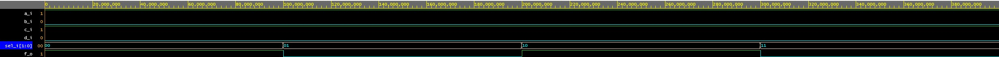

# Lab 3: Miloslav Kužela

### Three-bit wide 4-to-1 multiplexer

1. Listing of VHDL architecture from source file `mux_3bit_4to1.vhd`. Always use syntax highlighting, meaningful comments, and follow VHDL guidelines:

```vhdl
architecture Behavioral of mux_3bit_4to1 is
begin

with sel_i select --Multiplexer, selects input according to sel_i variable
	f_o <= a_i when "00",
	b_i when "01",
	c_i when "10",
	d_i when "11",
	'0' when others ;

end architecture Behavioral;
```

2. Screenshot with simulated time waveforms. Always display all inputs and outputs (display the inputs at the top of the image, the outputs below them) at the appropriate time scale!

   

3. Listing of pin assignments for the Nexys A7 board in `nexys-a7-50t.xdc`. **DO NOT list** the whole file, just your switch and LED settings.

```shell
##Switches
##Switches
set_property -dict { PACKAGE_PIN J15   IOSTANDARD LVCMOS33 } [get_ports { sel_i[0] }]; #IO_L24N_T3_RS0_15 Sch=sw[0] #Select 0
set_property -dict { PACKAGE_PIN L16   IOSTANDARD LVCMOS33 } [get_ports { sel_i[1] }]; #IO_L3N_T0_DQS_EMCCLK_14 Sch=sw[1] #Select 1
set_property -dict { PACKAGE_PIN R17   IOSTANDARD LVCMOS33 } [get_ports { a_i }]; #IO_L12N_T1_MRCC_14 Sch=sw[4] #Input a
set_property -dict { PACKAGE_PIN T18   IOSTANDARD LVCMOS33 } [get_ports { b_i }]; #IO_L7N_T1_D10_14 Sch=sw[5] #Input b
set_property -dict { PACKAGE_PIN U18   IOSTANDARD LVCMOS33 } [get_ports { c_i }]; #IO_L17N_T2_A13_D29_14 Sch=sw[6] #Input c
set_property -dict { PACKAGE_PIN R13   IOSTANDARD LVCMOS33 } [get_ports { d_i }]; #IO_L5N_T0_D07_14 Sch=sw[7] #Input d
...

## LEDs
set_property -dict { PACKAGE_PIN H17   IOSTANDARD LVCMOS33 } [get_ports { f_o }]; #IO_L18P_T2_A24_15 Sch=led[0] #Multiplexer output
...
```
